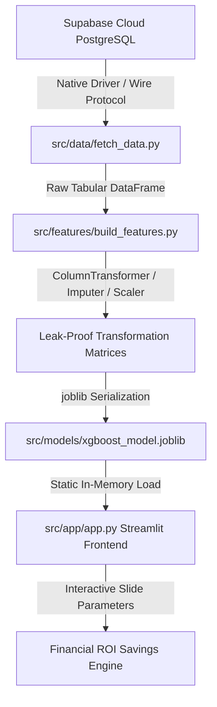

# 📊 End-to-End Telecom Churn Pipeline & Financial ROI Engine

A production-grade, modular machine learning pipeline that extracts consumer metadata over the wire from a cloud-hosted relational layer, executes leak-proof data transformations, and computes corporate customer retention margins using an optimized XGBoost ensemble engine.

🔗 **Live Production Deployment URL:** [View the Live Application Dashboard](https://streamlit.io) *(👈 Paste your exact Streamlit browser URL here!)*

---

## 🏗️ Architectural Flow & Data Infrastructure

### Technical Ecosystem Specifications
* **Infrastructure Layer:** Cloud-Hosted Relational Database (**Supabase PostgreSQL Instance** hosting 7,043 production records).
* **Data Transport Protocols:** Decoupled wire connection utilizing isolated system boundaries (`urllib.parse` + `pg8000.native`).
* **Processing Core:** Automated **Scikit-Learn ColumnTransformer** separating categorical pipes from numeric feature spaces to ensure zero data leakage.
* **Predictive Framework:** **XGBoost Ensemble Classifier** tuned with custom balance weight ratios (`scale_pos_weight: 2.77`) to counter raw dataset imbalances natively.
* **Artifact Serialization:** Static binary arrays packed via **joblib** to bypass live cloud database strain and ensure low-latency application scaling.
* **Container Virtualization:** Custom **Dockerfile** manifest exposing port `8501` for environment-agnostic deployment.

---

## 🎯 Production System Metrics

Evaluated strictly against an independent **20% holdout validation pool (1,409 unseen customer profiles)** to guarantee complete freedom from data leakage:

* **ROC-AUC Evaluation Score:** `0.8434` (Highly Competitive Separation Capacity)
* **True Positive Capture (Recall):** `81.00%` (Imbalance Resilient)
* **Overall Predictive Accuracy:** `76.00%`
* **Retained Class (0) Precision / Recall:** `0.92 / 0.74`
* **Churned Class (1) Precision / Recall:** `0.53 / 0.81`

---

## 💰 Business Value Outcomes & Campaign ROI

The pipeline explicitly translates high-dimensional mathematical probabilities into tangible executive metrics:

* **High-Throughput Risk Capture:** Out of **374 actual churners** in the evaluation split, the system successfully flags **302 accounts** before they cancel.
* **Proactive Revenue Protection:** At an average customer value of **₹650/month**, intercepting these accounts allows the business to safeguard over **₹1,15,000 in gross revenue** within a single retention cycle.
* **Measurable Campaign Profitability:** Operating a targeted incentive campaign at **₹150/offer** yields a net financial ROI profit of **₹70,400** (assuming a conservative 59% offer acceptance rate), successfully turning predictive analytics into a profit center.

---

## 📂 Repository Directory Layout
* `src/data/` - SQL fetching scripts and connection handlers.
* `src/features/` - Automated preprocessing pipelines and data cleaning scripts.
* `src/models/` - Training orchestration code and serialized binary models (`.joblib`).
* `src/app/` - Web presentation layers and financial ROI calculation engines.
* `Dockerfile` - Container virtualization configuration layout.
